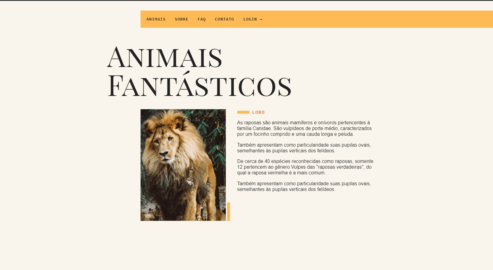
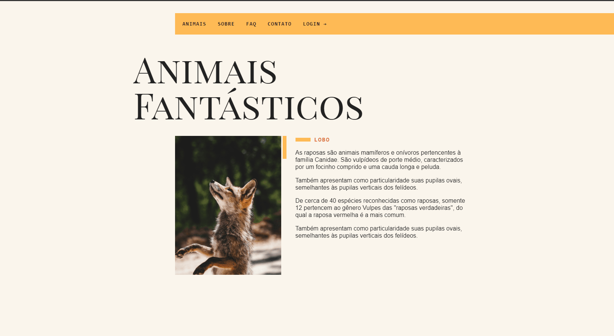
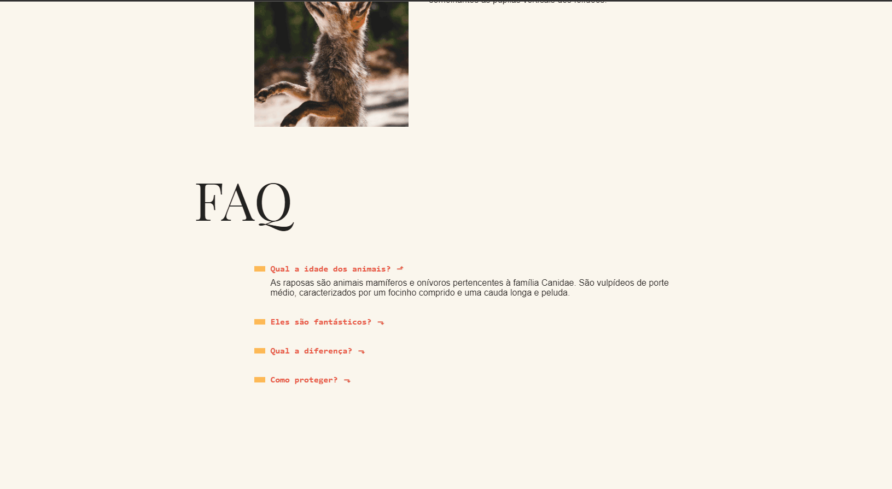
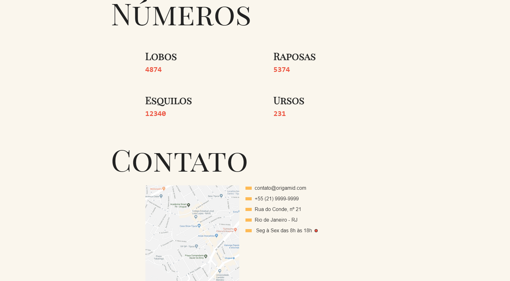

# Animais Fantásticos

## 🔖 Descrição

O origamid_animais_fantasticos é um projeto de conclusão, criado por mim, do módulo de javascript do curso da origamid.
<br>
<br>

## 🖼 Previews

<a href="https://julioguerradev.github.io/origamid_animais_fantasticos/">Live Preview</a>

Screens das telas encontram-se na pasta `./design`

## 🚀 Tecnologias

- HTML5 e CSS3
- JavaScriptkkkkkkkkk
- NodeJs (NPM)
- Webpack
- Eslint
- Babel

## Funcionalidades

### Scroll com animações


### Dropdown e Menu Mobile



### Modal



### Nav Tabs


### Accordion



### Slider


### Números animados e tooltip



## ℹ️ Como usar

Faça um clone deste repositório:

```sh
  $ git clone https://github.com/julioguerradev/origamid_animais_fantasticos.git
```

Instale as dependências:

```sh
  # com npm
  $ npm install

  # com yarn
  $ yarn install
```

Inicie o projeto com o comando:

```sh
  # com npm
  $ npm run dev

  # com yarn
  $ yarn run dev
```

Acesse o projeto abrindo o arquivo **index.html** no seu navegador.

## Author

**Júlio Guerra**

- Email: julio.guerra.dev@gmail.com
- GitHub: [@julioguerradev](https://github.com/julioguerradev)
- LinkedIn: [@julioguerradev](https://linkedin.com/in/julioguerradev)

## 📝 License

Copyright © 2023 João Victor Júlio / Origamid
